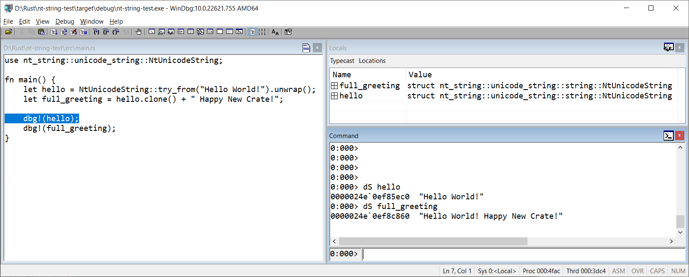

# nt-string

[](https://crates.io/crates/nt-string)
[](https://docs.rs/nt-string)


*by Colin Finck <<colin@reactos.org>>*

Provides idiomatic Rust implementations for various Windows string types:

* [`NtUnicodeString`](https://docs.rs/nt-string/latest/nt_string/unicode_string/struct.NtUnicodeString.html) (with [`NtUnicodeStr`](https://docs.rs/nt-string/latest/nt_string/unicode_string/ct.NtUnicodeStr.html) and [`NtUnicodeStrMut`](https://docs.rs/nt-string/latest/nt_string/unicode_string/struct.NtUnicodeStrMut.html)):
  For interfacing with the Windows kernel string type known as [`UNICODE_STRING`](https://learn.microsoft.com/windows/win32/api/ntdef/ns-ntdef-_unicode_string)
* [`U16StrLe`](https://docs.rs/nt-string/latest/nt_string/u16strle/struct.U16StrLe.html):
  For working with byte slices of UTF-16 (little-endian) strings

Other useful UTF-16 string types are already provided by the excellent [`widestring`](https://crates.io/crates/widestring) crate.
This crate tries to integrate as best as possible with them.

## In Action
  
Debugging a Rust application in WinDbg and using the [`dS`](https://learn.microsoft.com/en-us/windows-hardware/drivers/debugger/ds--ds--display-string-) command to display a `UNICODE_STRING` created in Rust.
As you see, this crate's `NtUnicodeString` and the original `UNICODE_STRING` are fully compatible.

## Details
The `UNICODE_STRING` type was designed for the C programming language, which only knows about NUL-terminated buffers of characters.
To determine the length of such a buffer, you need to iterate over all characters until finding the NUL.
Bad enough?
It gets worse:
A classic buffer overflow occurs if the buffer contains no NUL, but an algorithm attempts to find it anyway.

To overcome these performance and security hazards, `UNICODE_STRING`s consist of a buffer, a buffer capacity ("maximum length"), and a field to indicate the actually used length.
Determining length and capacity is now as simple as querying the corresponding fields.
Length and capacity are 16-bit values and expressed in bytes.

`UNICODE_STRING` has been widely used by the Windows kernel team and also spilled over to some user-mode APIs.
This crate makes `UNICODE_STRING` a first-class Rust citizen.
Safety is achieved via the following measures:

* `UNICODE_STRING` is split into 3 Rust types to handle references, mutable references, and owned strings separately.
  You should never need to call an `unsafe` method.
* All methods are fallible (except for allocations and traits like `Add`, where Rust currently does not provide fallible alternatives).
* The internal buffer is NUL-terminated whenever possible.
  While not required according to the specification, this defensive approach guards against external applications that never understood `UNICODE_STRING` and mistakenly treat its internal buffer as a NUL-terminated string.

Additionally, this crate provides the `U16StrLe` type.
With UTF-16 being the ubiquitous character encoding in Windows, many on-disk strings are stored in UTF-16 Little-Endian.
`U16StrLe` allows to perform basic operations on byte slices of such strings without converting them to another string type first.
One user is the [ntfs](https://github.com/ColinFinck/ntfs) crate.

## Examples
You can work with these string types just like you work with other Rust string types:

```rust,no_run
let mut string = NtUnicodeString::try_from("Hello! ").unwrap();
string.try_push_str("Moin!").unwrap();
println!("{string}");
```

Conversions are also supported from raw `u16` string buffers as well as the [`U16CStr`](https://docs.rs/widestring/latest/widestring/ustr/struct.U16CStr.html) and [`U16Str`](https://docs.rs/widestring/latest/widestring/ustr/struct.U16Str.html) types of the `widestring` crate:

```rust,no_run
let abc = NtUnicodeString::try_from_u16(&[b'A' as u16, b'B' as u16, b'C' as u16]).unwrap();
let de = NtUnicodeString::try_from_u16_until_nul(&[b'D' as u16, b'E' as u16, 0]).unwrap();
let fgh = NtUnicodeString::try_from(u16cstr!("FGH")).unwrap();
let ijk = NtUnicodeString::try_from(u16str!("IJK")).unwrap();
```

Just like a `String` automatically dereferences to a `&str` when you pass it to an appropriate function, you can do the same with an `NtUnicodeString` and it will dereference to an `&NtUnicodeStr`:

```rust,no_run
let string = NtUnicodeString::try_from("My String").unwrap();
subfunction(&string);

fn subfunction(str_ref: &NtUnicodeStr) {
    println!("Hello from subfunction with \"{str_ref}\".");
}
```

Constant `UNICODE_STRING`s can be created at compile-time.
This provides strings with a `'static` lifetime and saves a UTF-16 conversion at runtime:

```rust,no_run
const MY_CONSTANT_STRING: NtUnicodeStr<'static> = nt_unicode_str!("My Constant String");
```

Finally, you most likely want to pass your `NtUnicodeStr`, `NtUnicodeStrMut` or `NtUnicodeString` to an FFI function that expects a pointer to a `UNICODE_STRING`.
Use the [`as_ptr`](https://docs.rs/nt-string/latest/nt_string/unicode_string/struct.NtUnicodeStr.html#method.as_ptr) or [`as_mut_ptr`](https://docs.rs/nt-string/latest/nt_string/unicode_string/struct.NtUnicodeStrMut.html#method.as_mut_ptr) methods to get an immutable or mutable pointer.

## `no_std` support
The crate is `no_std`-compatible and therefore usable in all contexts.

However, the heap-allocating `NtUnicodeString` struct is only available via the `alloc` feature (enabled by default).
If you want to use the crate in a pure `no_std` environment without heap allocations, include it with `default-features = false` to disable the default `alloc` feature.

## License
This crate is licensed under either of

 * [Apache License, Version 2.0](http://www.apache.org/licenses/LICENSE-2.0)
 * [MIT license](http://opensource.org/licenses/MIT)

at your option.

Unless you explicitly state otherwise, any contribution intentionally submitted for inclusion in the work by you, as defined in the Apache-2.0 license, shall be dual licensed as above, without any additional terms or conditions.
